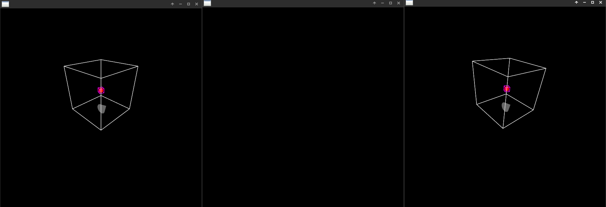

An Example
========
This example will show you how to work with cavr as a start.

**Libraries used**

1. IrrKlang 
2. X11
3. cavr
4. OpenGL

**Controls**

Escape: Quit

Left Mouse held: Roll global camera's view (holding)
When the mouse cursor is over a cone the mouse will rotate the cone along cone's central axis. (holding)

Right Mouse held: Rotate global cmaera
When the mouse cursor is over a cone the mouse will rotate the cone along the axis perpendicular to the cone's central axis. (holding)

Center Mouse held: 
When the mouse cursor is over a cone the cone will be moved along the x-z axis.

**Building the example**

In order to build this example you should follow the instructions in the root cavr directory for building with cmake and making a build folder.

Once you have followed those instructions. All you will have to simply do is go to where the executable has been built and run the code. Like the following:

```bash
cd build/examples/app2/
./example_app2
```

You may find issues if you did not set up the CAVR_PLUGIN_PATH. You will notice that the application is unable to render anything. A simple remdey is to either set up the CAVR_PLUGIN_PATH or move the plugins required for running this example to the same directory as example_app2. Here is an example of getting that to work.

```bash
# Run this command from the directory that contains example_app2
cp ../../lib/plugins/lib* .
```

**The Example**

In this example you will see a spinning wireframe cube with a sphere inside. There should also be a windy noise that is occuring. You should hear the noise going from left to right in your speakers or head phones. In this example a sound source is placed next to the spinning cube and the sphere inside lights up when the sound is about to go from one speaker to the other. The cone placed at the bottom is a camera used to give another vantage point into the world. Initialially there will be three windows stacked on top of each other. The first window is the cone's vantage point.

Here is what the example should generate (three windows):



**Initializing the example**

In the main of the app2.cpp you will notice that the main is rather simple and has very minimal code. This part of the example is very important because it initialize cavr and gives cavr information about what functions update, render, and initialize. Cavr is a multithread system that interfaces with its plugins through these defined callbacks:

```c++
  cavr::System::setCallback("update", update);
  cavr::System::setCallback("init_gl_context", initContext);
  cavr::System::setCallback("update_gl_context", frame);
  cavr::System::setCallback("gl_render", render);
  cavr::System::setCallback("destruct_gl_context", destructContext);
```

These lines of code are followed up with a input map that is used to grab information from cavr's input manager. The names in these code lines should actually be the input devices that are used in cavr's config files. This would be the place where a wiimote could be added to a user specified mapping with the name "wiimote". For this example only a keyboard is used. Here is the code for the input mapping setup:
```c++
  input_map.button_map["exit"] = "keyboard[Escape]";
  //input_map.button_map["color"] = "vrpn[Button0[0]]";
  //input_map.sixdof_map["wand"] = "emulated_wand";
  //input_map.sixdof_map["wand"] = "vrpn[Tracker0[0]]"; // This would be a tracker detected by a system.
  input_map.analog_map["rotation"] = "keyboard[analog[y0]]";
```

Cavr may use the command line to pass information it needs to setup a series of clients that is esentially what is occuring here: 
```c++
  if (!cavr::System::init(argc, argv, &input_map)) {
    LOG(ERROR) << "Failed to initialize cavr.";
    return -1;
  }
```

An important to note is that cavr will run until you call for it to shutdown like in the following lines in the update function: 

```
  if (cavr::input::getButton("exit")->delta() == cavr::input::Button::Pressed) {
    cavr::System::shutdown();
    return;
  }
```

So the app will run for forever until a shutdown call at these lines of code in the main function:
```c++
  // run cavr
  cavr::System::run();
  
  // We can only reach here when a shutdown is called
  LOG(INFO) << "Shutting down.";
  return 0;
```

The last section will show OpenGL is initialized for a custom shader program, cavr's interal simple program shaders, and IrrKlang. 

**Initializing the example**

In this example you will notice that there is code to load a simple shader program that is provided by the X11 plugin by cavr and a way to load a custom shader program. The code also introduces a way to use an audio named IrrKlang for 3D sounds. 

In the rest of the section will be large code segments that demonstrated how to initialize this example app.

Here is the initialization code for loading the simple shader program and a sphere:

```c++
  // Simple shader shader vbo and vao initialization
  std::vector<cavr::math::vec4f> sphere_vertices = 
    cavr::gfx::Shapes::solidSphere(30, 30);
  cd->num_triangles_in_sphere = sphere_vertices.size();
  cd->sphere_vbo = new cavr::gl::VBO(sphere_vertices);
  cd->sphere_vao = new cavr::gl::VAO();
  cd->sphere_vao->setAttribute(cd->simple_program->getAttribute("in_position"),
                               cd->sphere_vbo,
                               4,
                               GL_FLOAT,
                               0,
                               0,
                               0);
```

The simple shader program vertex and frag shader are in extensions/gl/source/shader.cpp from the cavr directory.

In this example two custom shaders are included which are shader.frag and shader.vert. These two custom shaders are used to create a custom shader program:
```c++
  cd->simple_program = cavr::gl::Program::createSimple();
  
  // Create a program using some custom code of ours
  cd->cube_program = new cavr::gl::Program();

  // custom shader initialization

  cavr::gl::VertexShader* vs = cavr::gl::VertexShader::fromFile("shader.vert");
  if (!vs) {
    LOG(ERROR) << "Failed to load simple vertex shader";
    cavr::System::shutdown();
    return;
  }

  cavr::gl::FragmentShader* fs = cavr::gl::FragmentShader::fromFile("shader.frag");
  if (!fs) {
    LOG(ERROR) << "Failed to load simple fragment shader";
    cavr::System::shutdown();
    return;
  }

  cd->cube_program->addShader(vs);
  cd->cube_program->addShader(fs);

  cd->cube_program->bindFragDataLocation(0,"color");
  cd->cube_angle = 0;
  if(!cd->cube_program->link())
  {
    LOG(ERROR) << "Failed to link simple shader";
    delete vs;
    delete fs;
    cavr::System::shutdown();
    return;
  }
  delete vs;
  delete fs;

  
  cd->mvp_uniform = cd->cube_program->getUniform("mvp");

  std::vector<cavr::math::vec4f> cubeTriangles = cavr::gfx::Shapes::wireCube();
  cd->num_triangles_in_cube = cubeTriangles.size();

  cd->cube_vbo = new cavr::gl::VBO(cubeTriangles,GL_STATIC_DRAW);
  cd->cube_vao = new cavr::gl::VAO();
  cd->cube_vao->setAttribute(cd->cube_program->getAttribute("pos"),
    cd->cube_vbo,
    4,
    GL_FLOAT,
    0,
    0,
    0);
```

Here is how IrrKlang is intialized for playing sound. Here is the code snippet:

```c++
  cd->engine = createIrrKlangDevice();
  cd->music = cd->engine->play3D("media/136608__thesoundcatcher__wind-in-small-forrest-01.wav",
    vec3df(15,1,0), // Music source position
    true, // play looped
    false, //  start paused
    true); //  enable sound
```


 
